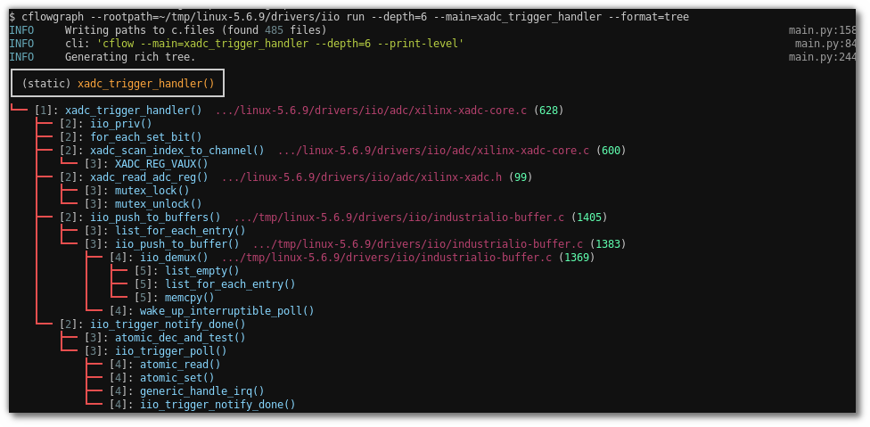
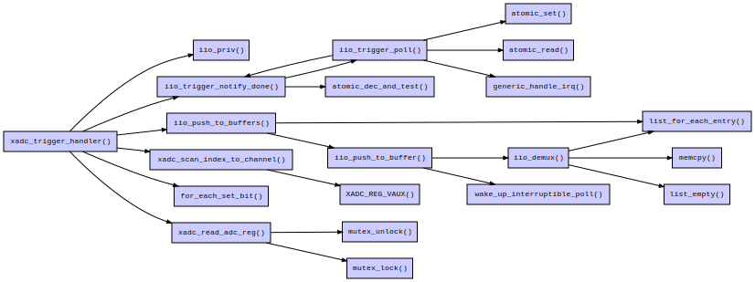
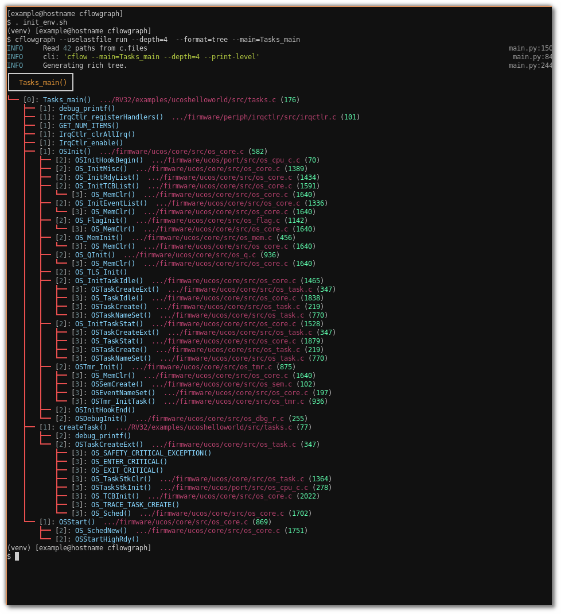
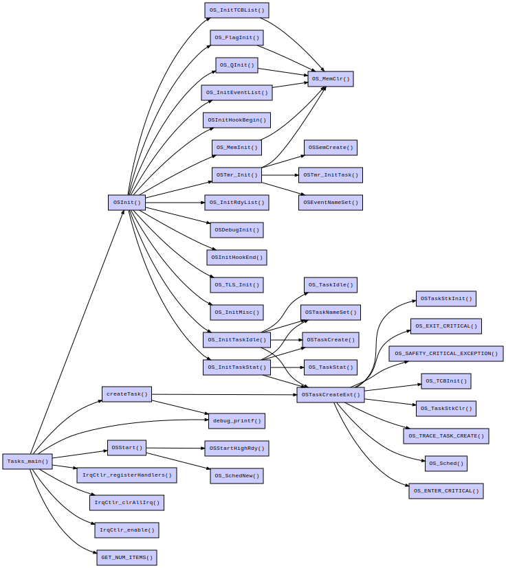

# cflowgraph

A utility which wraps [GNU cflow](https://gnu.org/software/cflow) to provide nicer output to the user.

This utility was inspired by the need to quickly generate a C call graph without
the overhead of a project-based tool. Essentially, I wanted to point a tool at a
list of files and tell it what function to graph. Gnu cflow looked to fit the
bill. It can handle a large set of source files and quickly provides a textual call
graph output. The cflow output, while readable, could be improved with the use
of modern libraries now available.

## Description

Top-level cli help:

```
$ cflowgraph -h
Usage: cflowgraph [OPTIONS] COMMAND [ARGS]...

  C function call graph generator (using Gnu cflow).

Options:
  --rootpath TEXT       Root path to search for files
  --excludepath TEXT    Excluded path (can be repeated).
  --nobuiltin-excludes  Don't use any built-in exclude paths.
  --usefile TEXT        Path to file containing paths.
  --uselastfile         Use last written c.files
  --loglevel TEXT       Logging level [debug, info, warning, error]
  --debug               Shortcut for --loglevel=debug
  -h, --help            Show this message and exit.

Commands:
  run  Generates the call graph for a function.
```

`cflowgraph` will generate a C call-graph as a tree or as a dot-graph (png). You
can provide the reference codebase in a few ways:

1. The `--rootpath` option specifies a path to some location in a codebase
   (such as the top). All .c and .h files below that path will be found and
   placed in a file `c.files`. This will contain a newline-separated list of
   paths to source files that were found.

2. The `--usefile` option specifies an existing newline-separated list of files.

3. `--uselastfile` instructs to use the existing c.files present in the working
   directory.

4. You can also supply paths that you want excluded via the `--excludepath`
   option.  This may be repeated for excluding multiple paths. A path will be
   excluded if any part of the excluded path is contained in a searched path.
   For example, `--exclude=site-packages` will exclude any path containing the
   string `site-packages`. (Note: 'site-packages' is a built-in exclude path.
   The `--nobuiltin-excludes` option removes all built-in exclude paths).


The `run` command is where you specify what function to graph, how deep the
graph should go and what format you'd like to see the output.

```
$ cflowgraph run -h
Usage: cflowgraph run [OPTIONS]

  Generates the call graph for a function.

Options:
  --main TEXT        Function target to graph.
  --depth TEXT       Call graph depth.
  --reverse          Generate reverse graph.
  --format TEXT      Format of output: [tree, dot, raw] (default is tree).
  --dotfile TEXT     File name for dot ouput. Valid extensions are .png, .svg,
                     .pdf  [default: dot.svg]
  --show-signatures  Shows function signatures.
  --pager            Use pager for output.
  --stderr           Print cflow stderr output.
  --debug            Shortcut for --loglevel=debug
  -v, --verbose      Extra debug verbosity
  -h, --help         Show this message and exit.
```

Options:

- `--main` specifies what function cflow should generate a graph for. If not
  provided, cflow will generate call graphs for every function if finds. The
  output could get large.

- `--depth` specifes to cflow how many call levels to trace.

- `--reverse` not yet supported by cflowgraph.

- `--format` specifies the display format (may be repeated for multiple outputs):
    * `raw`: raw output from cflow (unfiltered)
    * `tree`: displays a tree (a [rich](https://github.com/Textual/rich) tree)
    * `dot`: displays a dot graph (using graphviz)

- `--pager` specifes to use a pager to view the output (raw and tree format
  outputs only).

- `--stderr` shows the stderr output from cflow if you think errors have
  occurred.

- `--show-signatures` shows function call signatures in tree output.

### Example: Graph xadc_trigger_handler() in Linux kernel drivers/iio (tree output)

`$ cflowgraph --rootpath=~/tmp/linux-5.6.9/drivers/iio run --depth=6 --main=xadc_trigger_handler --format=tree`



:heavy_check_mark: Normally `cflow` will not find functions declared as *static*.
Instead, it will provide a call graph for every function in the codebase. 
`cflowgraph` will search through cflow's results for the static function
provided via the `--main` option and extract the call graph. For these cases,
`(static)` will be printed at the top of the tree output, as shown in the
example above.

### Example: dot output

`$ cflowgraph --rootpath=~/tmp/linux-5.6.9/drivers/iio run --depth=6 --main=xadc_trigger_handler --format=dot`



## Other examples:



<p align="center">
    
</p>
